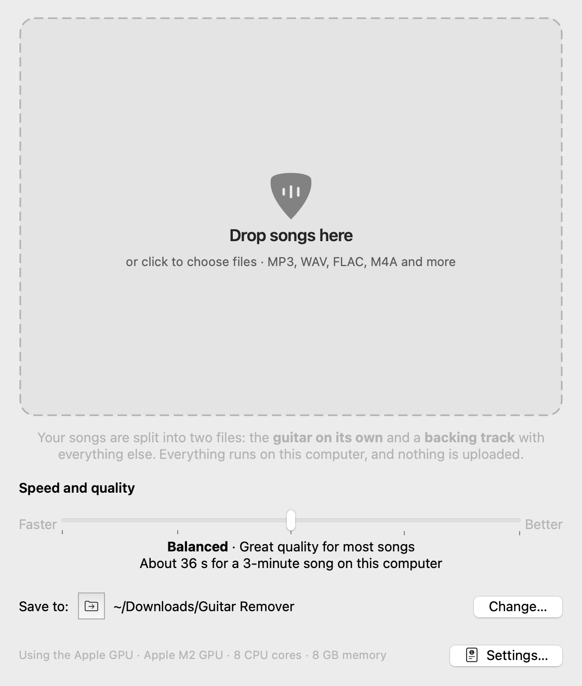
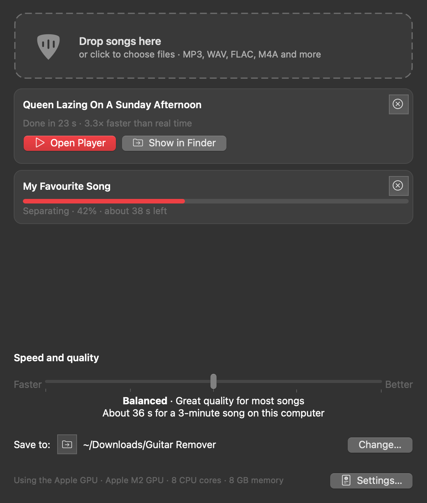
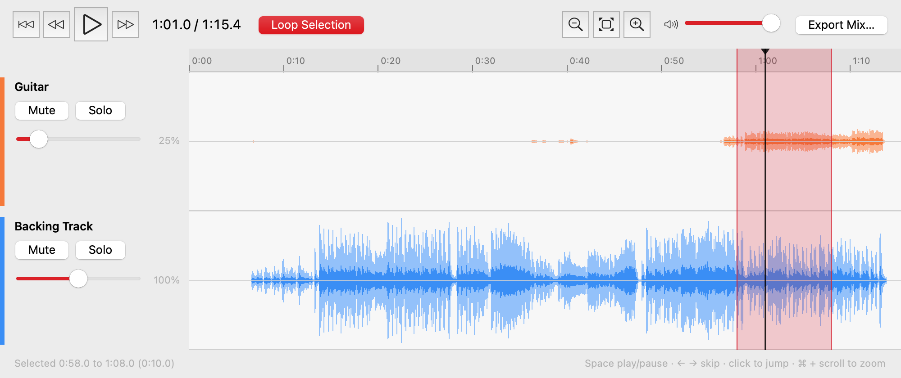

<p align="center">
  
</p>

<h1 align="center">Guitar Remover</h1>

<p align="center">
  Make guitar backing tracks from any song, entirely on your own computer.<br>
  macOS · Windows · Linux
</p>

Drop in a song and Guitar Remover gives you two files: **the guitar on its own** and a
**backing track** with everything else. A built-in player then shows both as waveforms, so
you can mute the guitar, loop a tricky section and play along. Nothing is uploaded, and
after a one-off 55 MB model download it works offline.

It uses Meta's [Demucs](https://github.com/adefossez/demucs) `htdemucs_6s` model, which has
a dedicated guitar stem. Other Demucs models can be chosen in Settings.

<p align="center">
  
  
</p>
<p align="center">
  
</p>

## Download

| System | Download | Notes |
|---|---|---|
| macOS 12+ (Apple Silicon) | [Guitar-Remover-macOS-arm64.dmg](https://github.com/j4ckxyz/guitar-remover/releases/latest/download/Guitar-Remover-macOS-arm64.dmg) | Uses the Apple GPU (Metal) |
| Windows 10/11 (64-bit) | [Guitar-Remover-Windows-x64.zip](https://github.com/j4ckxyz/guitar-remover/releases/latest/download/Guitar-Remover-Windows-x64.zip) | CPU build. NVIDIA owners: use the one-command install below to get GPU support |
| Linux x86_64 | [Guitar-Remover-Linux-x86_64.tar.gz](https://github.com/j4ckxyz/guitar-remover/releases/latest/download/Guitar-Remover-Linux-x86_64.tar.gz) | CPU build. NVIDIA/AMD owners: use the one-command install below |

All releases are on the [releases page](https://github.com/j4ckxyz/guitar-remover/releases).
Intel Macs are not supported, because PyTorch no longer publishes builds for them.

## Quickest install: one command

The installer picks the right build for your computer, adds the app to your Launchpad,
Start menu or app menu, and avoids the "unidentified developer" warnings described below.
On a PC with an NVIDIA graphics card, it installs from source instead, so you get the
CUDA (GPU) version of PyTorch.

**macOS and Linux** (Terminal):

```sh
curl -fsSL https://raw.githubusercontent.com/j4ckxyz/guitar-remover/main/install.sh | sh
```

**Windows** (PowerShell):

```powershell
irm https://raw.githubusercontent.com/j4ckxyz/guitar-remover/main/install.ps1 | iex
```

Options:

- Force a from-source install:
  - macOS and Linux: `curl -fsSL …/install.sh | sh -s -- --source`
  - Windows: save `install.ps1`, then run `.\install.ps1 -Source`
- Uninstall: the same command with `--uninstall` (macOS and Linux) or `-Uninstall` (Windows).

Source installs use [uv](https://docs.astral.sh/uv/). The installer sets up uv if you don't
have it, and uv's `--torch-backend auto` picks the right PyTorch build (CUDA, ROCm or CPU)
for your hardware.

## Installing from the download by hand

The apps are not signed with a paid Apple or Microsoft certificate, so the first launch
shows a warning. Each fix below takes a few seconds and only needs doing once.

### macOS: "Apple could not verify 'Guitar Remover' is free of malware"

1. Open the `.dmg` and drag **Guitar Remover** into **Applications**.
2. Run this in Terminal, which removes the "downloaded from the internet" flag:

   ```sh
   xattr -dr com.apple.quarantine "/Applications/Guitar Remover.app"
   ```

   Or, without Terminal: try to open the app once, then go to **System Settings → Privacy &
   Security**, scroll down and click **Open Anyway**. On macOS 14 and earlier,
   right-clicking the app and choosing **Open** also works.

### Windows: "Windows protected your PC" (SmartScreen)

- Click **More info**, then **Run anyway**.
- Or, before extracting: right-click the `.zip` → **Properties** → tick **Unblock** → **OK**.
- Or, in PowerShell inside the extracted folder: `Get-ChildItem -Recurse | Unblock-File`

Then run `GuitarRemover.exe`.

### Linux

```sh
tar -xzf Guitar-Remover-Linux-x86_64.tar.gz
./GuitarRemover/install-local.sh    # adds it to your app menu and ~/.local/bin
```

If it doesn't start, or there's no sound, install two small system libraries:

| Distribution | Command |
|---|---|
| Debian / Ubuntu | `sudo apt install libxcb-cursor0 libportaudio2` |
| Fedora | `sudo dnf install xcb-util-cursor portaudio` |
| Arch | `sudo pacman -S xcb-util-cursor portaudio` |

## Using it

1. **Drop songs** (or whole folders) onto the window, or click to choose files. MP3, WAV,
   FLAC, M4A, AAC, OGG, Opus, AIFF, WMA and the audio from video files all work.
2. Choose **Faster ↔ Better** on the slider. The caption tells you how long a typical song
   takes on *your* computer, and the estimate improves as the app learns your machine's speed.
3. Files are saved to `Downloads/Guitar Remover/<Song>/`. Click **Change…** to choose
   another folder.
4. When a song is ready, the **player** opens (you can turn this off in Settings).

### The player

A small Audacity-style window with the guitar and backing track shown as waveforms.

- **Play, pause and skip** with the transport buttons or the keyboard.
- **Click** a waveform to jump there. **Drag** across it to select a section, then press
  **Loop Selection** to practise that part on repeat.
- **Mute** or **Solo** each track, and set each track's **volume** (0 to 200%; double-click
  the slider to reset it). The waveforms redraw to match what you hear.
- **Zoom** with the buttons, **⌘/Ctrl + scroll**, or a trackpad pinch.
- **Export Mix…** saves exactly what you hear (volumes, mutes, solos, and the selection if
  there is one) as WAV, FLAC or MP3. For example, you can keep 20% of the original guitar as
  a guide while you learn.
- **File → Open Tracks in Player…** opens any audio files (up to six) side by side.

| Key | Action |
|---|---|
| Space | Play / pause |
| ← / → | Back / forward 5 seconds |
| Home / End | Start (or loop start) / end |
| L | Loop the selection on or off |
| + / − / 0 | Zoom in / out / show the whole song |

### Settings

Open with **⌘,** (macOS) or **Ctrl+,** (Windows and Linux).

- **General**:
  - where to save, and whether each song gets its own folder
  - file format: WAV 16-bit, 24-bit or 32-bit float, FLAC, or MP3
  - whether to remove the vocals too, for a full instrumental
  - what happens when a song is done
- **Performance**: a **Lighter ↔ Faster** slider and a GPU switch. This tab also shows
  exactly how the app will use your hardware.
- **Advanced**, for experimenting (the defaults are right for almost everyone):
  - which model to use: the built-in list, any Demucs model on the
    [Hugging Face hub](https://huggingface.co/adefossez), or a local model folder
  - which part to remove
  - custom shifts, window overlap and window length
  - how the backing track is made, and how clipping is handled
  - saving every separated part (drums, bass, vocals, piano, other)
  - device and thread overrides, and where models are stored

The interface follows your system's light or dark mode and accent colour, and uses each
platform's native look and icons: SF Symbols on macOS, Fluent icons with the Windows 11
style on Windows, and your icon theme on Linux. Windows 10 and Linux use Qt's Fusion style,
which also follows dark mode. Settings are stored natively: a plist on macOS, the registry
on Windows, and `~/.config` on Linux.

## How it uses your hardware

Guitar Remover detects your CPU cores, memory and graphics card, and turns the
*Lighter ↔ Faster* setting into a concrete plan:

| | Lighter | Balanced | Faster |
|---|---|---|---|
| Device | GPU if present | GPU if present | GPU if present |
| CPU threads | about 40% of cores | about 75% of cores | every core |
| Parallel CPU workers | none | none | 2 (8+ cores and 16 GB+) |
| Process priority | lowered | normal | normal |

Supported GPUs:

- Apple Silicon (Metal)
- NVIDIA (CUDA)
- AMD on Linux (ROCm, through a source install)

If the GPU hits an unsupported operation, the song is automatically retried on the CPU.

Songs are processed in **blocks sized to your memory**: 2 minutes on 8 GB machines, up to
10 minutes on 32 GB and above. Each block lines up with the model's window grid and is
padded with whole windows of real audio on both sides. The result is identical to
processing the whole song in one go (measured difference: −104 dB), while memory use stays
flat however long the song is. Graphics cards with less than 4 GB of memory automatically
use shorter windows.

### Measured on a Mac mini (M2, 8 GB)

Queen, *Lazing On A Sunday Afternoon* (1:15), `htdemucs_6s`:

| Setting | Apple GPU | CPU only |
|---|---|---|
| Fastest | 6.1× real time, 0.8 GB peak memory | 3.4× real time, 2.1 GB |
| High | 2.5× real time, 0.9 GB | 1.4× real time, 2.3 GB |

The packaged app peaks at about 0.75 GB while separating and uses about 0.3 GB when idle.

## Built with

**Libraries**

| Library | Used for |
|---|---|
| [Demucs](https://github.com/adefossez/demucs) (MIT) | The separation models |
| [PyTorch](https://pytorch.org) | Running the models on the GPU or CPU |
| [Qt for Python (PySide6)](https://doc.qt.io/qtforpython-6/) | The native user interface |
| [python-sounddevice](https://python-sounddevice.readthedocs.io) and [PortAudio](https://www.portaudio.com) | Live playback in the player |
| [python-soundfile](https://github.com/bastibe/python-soundfile) and [libsndfile](https://libsndfile.github.io/libsndfile/) | Writing WAV and FLAC files |
| [imageio-ffmpeg](https://github.com/imageio/imageio-ffmpeg) and [FFmpeg](https://ffmpeg.org) | Reading every audio format, and writing MP3 |
| [NumPy](https://numpy.org) | Audio processing and waveform drawing |
| [psutil](https://github.com/giampaolo/psutil) | Hardware detection and process priority |
| [huggingface_hub](https://github.com/huggingface/huggingface_hub), [HTTPX](https://www.python-httpx.org), [safetensors](https://github.com/huggingface/safetensors), [PyYAML](https://pyyaml.org) | Downloading and loading models |

**Tools**

| Tool | Used for |
|---|---|
| [uv](https://docs.astral.sh/uv/) | Python environments and the one-command source install |
| [PyInstaller](https://pyinstaller.org) | Building the standalone apps |
| [GitHub Actions](https://docs.github.com/actions) | Building releases for all three platforms |
| [pytest](https://pytest.org) and [pyflakes](https://github.com/PyCQA/pyflakes) | Tests and linting |

### Why Python and Qt?

Demucs is a PyTorch model, and Python is where PyTorch runs natively with full GPU
acceleration on every platform. The interface is built from real Qt widgets rather than a
web page, so it looks and behaves like a native app, starts quickly and stays light on memory.

## Running from source

```sh
git clone https://github.com/j4ckxyz/guitar-remover
cd guitar-remover
uv venv -p 3.12 && uv pip install --torch-backend auto -e .
.venv/bin/guitar-remover          # Windows: .venv\Scripts\guitar-remover.exe
```

## Building the apps

| System | Command | Output |
|---|---|---|
| macOS | `packaging/build_macos.sh` | `Guitar Remover.app` and a `.dmg` (ad-hoc signed) |
| Windows | `powershell -ExecutionPolicy Bypass -File packaging\build_windows.ps1 [-Cpu]` | `GuitarRemover.exe` folder and a `.zip` |
| Linux | `packaging/build_linux.sh [--cuda]` | `GuitarRemover` folder and a `.tar.gz` |

Every push to `main` is a release. Bump `__version__` in `src/guitar_remover/__init__.py`
and add a matching section to [CHANGELOG.md](CHANGELOG.md), and
[the release workflow](.github/workflows/release.yml) builds all three apps, tags `vX.Y.Z`
and publishes them. Pushes without a new version are rejected; see [AGENTS.md](AGENTS.md).
Run `git config core.hooksPath .githooks` once so the check also runs before each push.

Windows and Linux releases are CPU builds, because CUDA builds are larger than GitHub's
2 GB file limit. GPU users get CUDA through the one-command install instead.

To check a build without opening the window, run
`GuitarRemover --selftest song.mp3 output_folder`.

## Tests

```sh
uv pip install pytest
TEST_SONG=song.mp3 .venv/bin/python -m pytest tests   # engine and player mixer
.venv/bin/python tests/run_headless.py SONG [0-4]     # one separation, with a memory watchdog
.venv/bin/python tests/ui_smoke.py SONG OUT [light|dark]  # drives the real UI, saves screenshots
```

## Project layout

```
src/guitar_remover/
  hardware.py    hardware detection and the resource plan
  models.py      model catalogue, downloads with progress, loading
  separator.py   block-wise separation, output mixing and writing
  playback.py    real-time multitrack mixer for the player
  audio_io.py    reading and writing audio through a bundled FFmpeg
  settings.py    settings (plist / registry / ~/.config)
  runner.py      background job queue
  app.py         entry point, platform styling, --selftest
  ui/            main window, player, settings, widgets, icon
packaging/       PyInstaller spec, build scripts, Linux desktop entry
tools/           check_version.py, the release version gate
install.sh       one-command installer for macOS and Linux
install.ps1      one-command installer for Windows
```

## Licence

Guitar Remover is released under the MIT Licence. Demucs and its pretrained models are MIT
licensed by Meta Platforms, Inc. Please respect the copyright of the music you process.
